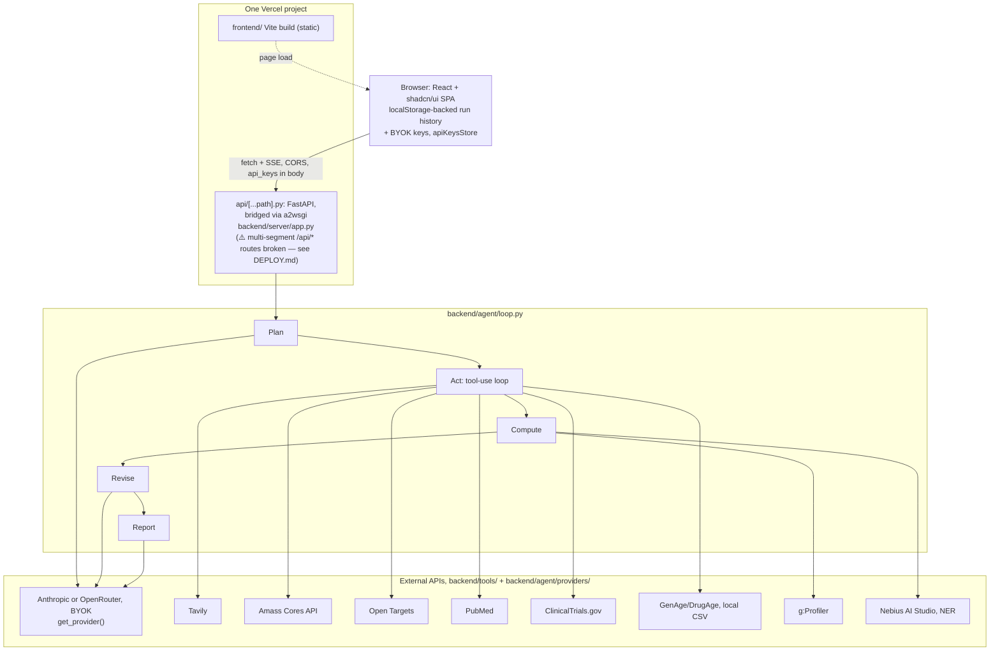

# Architecture

See [`docs/UX_SPEC.md`](UX_SPEC.md) for the hypothesis lifecycle, the
two-stage progress/results UX, and the full SSE event inventory.

## Goals this design is optimized for

1. Agent plans, retrieves, calls tools, and revises without hand-holding.
2. At least one real biological/data tool call inside the reasoning loop —
   the enrichment analysis is a computed result, not a text summary.
3. A cited final report a clinician or investor can read in one pass.
4. Stated uncertainty and failure modes as a first-class report section.
5. A demo a judge can re-run from a clean checkout in under 30 minutes,
   plus a recorded fallback artifact.

## System diagram

In production, frontend and backend ship inside **one Vercel project**: the
frontend is a static Vite build with no server-side code, and the backend
is a plain JSON/SSE API packaged as a Python serverless function serving
`/api/*` in that same project — they don't share a process, but they do
share a deployment. Locally they're still two independent processes that
both collapse to `localhost` (see [`docs/DEPLOY.md`](DEPLOY.md) for the
full deployment story, including a Vercel-account-specific gotcha in how
the backend's Python function is actually wired up).



## Agent loop (`backend/agent/loop.py`)

Implemented as a manual, provider-agnostic tool-use loop (not the Claude
Agent SDK) — chosen for transparency and low dependency risk within a
36-hour build: every step is inspectable state, not framework magic. Every
LLM call goes through `backend/agent/providers/get_provider()`, which
selects OpenRouter or Anthropic depending on which BYOK key was supplied —
with both, a `FallbackProvider` starts on Claude (model per deployment from
`backend/config/models.toml`) and moves to OpenRouter's free models only if
Claude fails, sticky for the rest of the run (see `docs/DEPLOY.md`) — the
loop itself never branches on which provider is in use. A switch mid-run
works because each adapter rebuilds its wire format from the neutral
`LLMResponse` fields rather than replaying the other one's `raw`.

```
1. PLAN     A dedicated, tool-less Anthropic call (mirrors REVISE below):
            Claude proposes 2-4 candidate hypotheses as a structured
            ```json fence (see UX_SPEC.md), each assigned a stable id
            (h1..hN) that is reused verbatim for the rest of the run —
            never renumbered at REVISE or REPORT. Emitted live as a
            `hypotheses` SSE event (stage "plan") before any tool call.
2. ACT      Standard tool-use loop: Claude calls tools, we execute them via
            the registry, append tool_result blocks, repeat. Every tool
            result is stored in the evidence registry with a stable
            citation ID (e.g. [PMID:12345678], [OT:ENSG00000142192],
            [NCT:NCT01234567], [S3] for a Tavily/Amass hit).
3. COMPUTE  Once literature/DB evidence names candidate genes/proteins, the
            agent calls extract_genes (Nebius-hosted model NER over the
            retrieved abstracts) to build a gene list, then calls
            run_enrichment (g:Profiler) against it. This is the required
            "real tool call, not just summarization" step producing an
            actual statistical result (adjusted p-values per pathway).
4. REVISE   A dedicated turn: "given all evidence and the enrichment
            result, revise your hypothesis ranking; name the best-
            supported hypothesis, name contradicting evidence, and specify
            the next experiment." Also re-emits the same PLAN-issued ids
            with confidence, rationale, and evidence_ids/contradicting_ids
            now filled in (`hypotheses` SSE event, stage "revise") — this
            is where the agent is forced to weigh evidence rather than
            just concatenate it.
5. REPORT   Final markdown: Hypothesis / Evidence For / Evidence Against /
            Confidence & Uncertainty / Failure Modes / Next Experiment.
            Every factual sentence must carry an inline citation ID
            resolvable in the evidence registry. A trailing `hypotheses`
            SSE event (stage "final") carries the same stable ids with
            their final rank/confidence/evidence links.
```

Each stage's hypotheses list only ever overwrites `RunState.hypotheses` if
parsing produced a non-empty result (`backend/agent/loop.py`'s
`_normalize_hypotheses`) — a malformed fence at REVISE or REPORT never
erases an earlier good stage, so the frontend always has something to
show even on a partial/error run.

Budget enforcement: `MAX_TOOL_CALLS` (default 30) and a wall-clock
timeout (default 18 min) in `state.py`. On timeout the loop still forces a
REPORT pass over whatever evidence exists, flagged as a partial run —
never silently truncates without saying so.

## Evidence registry & citation discipline (`backend/agent/state.py`)

Every tool result is appended to `RunState.evidence` as:

```python
{"id": "PMID:12345678", "source": "pubmed", "url": "...", "title": "...", "summary": "...", "raw": {...}}
```

`title` is a human-readable label (paper/trial title, or a synthesized
one for association-style sources like Open Targets) — populated per-tool
so the frontend can render a titled link instead of a bare citation id or
a truncated summary string.

The report-writing prompt requires every claim to end in `[id]` matching a
registry entry. `scripts/validate_citations.py` parses a finished report,
extracts every `[id]` marker, and checks each resolves to a registry entry
with a working URL — this is the automated check behind the "95% of
claims carry a working citation" bar, run as part of `run_demo.py`.

## Tool registry (`backend/tools/registry.py`)

Each tool module exposes:

- `SPEC` — the Claude tool schema (name, description, input schema)
- `run(args: dict) -> dict` — executes the call; on missing API key or
  network failure, returns `{"mock": true, "error": "...", ...}` with
  representative sample shape so the loop degrades gracefully rather than
  crashing.

`ENABLED_TOOLS` (env var, comma-separated tool names) filters which `SPEC`s
are offered to Claude each run. This is the mechanism behind the judge
"turn a tool off" test: remove `open_targets` from the list and re-run —
the hypothesis ranking and citation mix visibly change because that
evidence is no longer available to reason over.

A second, runtime-only layer sits on top of `ENABLED_TOOLS`:
`registry.set_tool_enabled(name, bool)`, exposed via `PUT
/api/tools/{name}` and driven by the frontend's per-tool switches. It's an
in-memory override (resets to the `ENABLED_TOOLS` env default on process
restart) that `enabled_tool_names()` layers on top of the env-derived set.
Toggling a tool from the UI is deliberately **snapshot-at-run-start**:
`loop.py` captures `RunState.enabled_tools` once when a run begins and
passes that explicit set into every `run_tool()` call for the run's
lifetime, so flipping a switch mid-run never changes an in-flight run's
behavior or cost accounting — only the *next* run sees it.

## Cost & usage tracking (`backend/agent/costs.py`)

Every run accumulates real usage as it goes (`backend/agent/state.py`):
Anthropic token counts from each `messages.create()` response, Nebius
token counts from `extract_genes`'s OpenAI-compatible response, Amass's
account credit balance (sampled once before and once after the run's Amass
calls via `amass_tool.get_credits()`, a real number from `GET
/credits/api-credits`), and live/mock call counts per tool from the
existing trace. `build_cost_summary()` turns that into a per-provider
breakdown attached to the `done` SSE event and the saved report JSON.

The rule that shapes this module: **never show a dollar figure that isn't
backed by a real, configured rate.** Anthropic's price table is hardcoded
(confirmed pricing, re-verify periodically — it drifts). Nebius/Amass/Tavily
have no stable public per-unit price, so their `$` is `null` unless you set
`NEBIUS_PRICE_PER_1M_INPUT`/`_OUTPUT`, `AMASS_PRICE_PER_CREDIT`, or
`TAVILY_USD_PER_CALL` — otherwise the UI shows "rate not configured" next
to the real token/call/credit counts, never a guessed number.

## Open TODOs / confirm at the event

- **Amass**: contract confirmed 2026-09-12 against
  `https://api.amass.tech/api/doc/openapi.json`. It's `GET
  {AMASS_API_URL}/cores/{core}/records?query=...&limit=...` with
  `Authorization: Bearer <AMASS_API_KEY>`, one endpoint per Core
  (biomedcore/trialcore/drugcore/patentcore/genecore/regulatorycore).
  `backend/tools/amass_tool.py` maps `biomedcore`, `trialcore`, and
  `patentcore` records to citations from their confirmed schemas;
  `drugcore`/`genecore`/`regulatorycore` fall back to a generic
  name-like-field guess since their record schemas weren't in the fetched
  OpenAPI spec — tighten that mapping if/when those fields are confirmed.
- **Nebius**: `NEBIUS_API_KEY` has never been set (no key issued yet) — the
  `extract_genes` tool runs on its regex heuristic fallback in every real
  run so far, which is non-fatal but cruder than the real NER model. Set
  `NEBIUS_API_KEY`/`NEBIUS_BASE_URL`/`NEBIUS_MODEL` once real Token Factory
  credentials exist; no code change needed.
- **Knowledge trajectory across runs**: the grounding's premise graph is
  drawn in the browser from the run's own events
  (`frontend/src/lib/trajectory.ts`, a port of `backend/kgviz/graph.py`),
  so it works on the stateless deployment — but only for the current run.
  The knowledge base that would let it show other runs of the same
  question and each link's verdict history (`runs/knowledge.db`) needs a
  persistent store on serverless; see CLAUDE.md's Open TODOs.
- **GenAge/DrugAge**: HAGR does not expose a live query API; datasets are
  downloaded once via `scripts/fetch_datasets.py` from
  https://genomics.senescence.info/download and queried locally. Confirmed
  working both locally and inside the deployed Docker image (the `RUN
  python scripts/fetch_datasets.py` build step succeeds there).

## A note on network access in dev sandboxes

Early in this project's life, this exact Claude Code sandbox appeared to
block outbound calls to `eutils.ncbi.nlm.nih.gov`,
`api.platform.opentargets.org`, `clinicaltrials.gov`, and `biit.cs.ut.ee`
(403 at the CONNECT level). That turned out not to be a durable restriction
— every one of those hosts, plus Tavily, Amass, and the Anthropic API, was
called successfully many times over from this same sandbox later in
development (see the many live runs recorded in `backend/reports/`). If a
keyless tool call ever does get blocked in some environment, the mock
fallback contract (`tests/test_tools.py`) means the agent degrades
gracefully rather than crashing — but don't assume a given sandbox's
egress policy is fixed without testing it.

## Stretch goals (explicitly out of MVP scope)

- ElevenLabs voice briefing of the final report.
- (Done) A polished frontend — shipped as a Vite + React + shadcn/ui SPA,
  see `frontend/` and the System diagram above.
