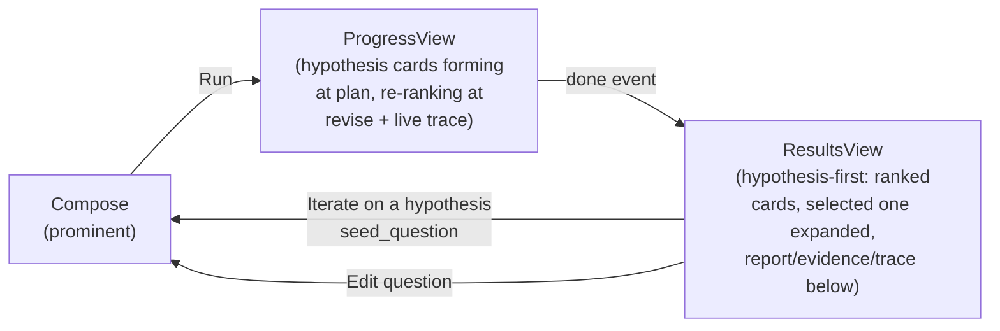

# UX spec: hypothesis-first progress & results

This spec covers what `docs/ARCHITECTURE.md` doesn't: the shape of the
hypothesis lifecycle over the wire, and how the frontend turns that into
two distinct screens — a live **progress** view and a **results** view —
instead of one continuous page.

## Why two stages

Before this redesign, the frontend was a single component tree with one
`if (doneEvent)` branch: while running it showed only a raw tool-call
trace, and on completion it showed a dense hypotheses table bolted above
a hand-rolled markdown renderer. Multiple hypotheses only ever existed as
a best-effort JSON fence scraped out of the final report text — often
empty, and never available until the run had already finished. There was
nothing to show a user *while* the agent was still working.

The fix is backend-first: the agent now proposes hypotheses as a
dedicated, structured step at the *start* of a run (mirroring the
existing forced REVISE turn), with stable ids that survive the whole run.
That makes a real progress view possible, and makes the results view
something to explore hypothesis-by-hypothesis rather than a single
undifferentiated report blob.

## The hypothesis lifecycle

A hypothesis is assigned an id (`h1`, `h2`, …) exactly once, at PLAN, and
that id is never renumbered or reinvented at REVISE or REPORT — components
must key on `id`, never on `rank` (which changes every stage as the
ranking is revised).

| Field | PLAN | REVISE | REPORT (final) |
|---|---|---|---|
| `id` | assigned here | reused | reused |
| `rank` | insertion order | model's ranking | model's final ranking |
| `statement` | ✓ | ✓ (may be refined) | ✓ |
| `seed_question` | ✓ | ✓ | ✓ |
| `confidence` | always `null` | `"high"\|"medium"\|"low"` | same |
| `selected` | always `false` | exactly one `true` | exactly one `true` |
| `rationale` | `""` | ✓ | ✓ |
| `evidence_ids` | `[]` | ✓ (filtered against the registry) | ✓ |
| `contradicting_ids` | `[]` | ✓ (filtered against the registry) | ✓ |

Every stage emits the **full** shape above (never a thinner one) — at
PLAN, the not-yet-evaluated fields are simply present-but-empty
(`null`/`""`/`false`/`[]`), not absent. This is a deliberate choice so the
frontend has one `RankedHypothesis` type instead of a union: a PLAN-stage
card renders an explicit "unevaluated" badge (not a fake "low
confidence") purely by checking `confidence === null`.

Backend enforcement (`backend/agent/loop.py`, `_normalize_hypotheses`):
- PLAN mints fresh ids for whatever the model proposed; nothing is ever
  auto-selected here (nothing has been evaluated yet).
- REVISE/REPORT match incoming items against the PLAN-issued id roster
  and **drop, never adopt**, anything with an unrecognized id. Exactly one
  `selected: true` is enforced (defaulting to the top-ranked item if the
  model gave zero or more than one).
- `evidence_ids`/`contradicting_ids` are filtered against the run's real
  evidence registry keys — a card can never link to a citation that
  doesn't exist.
- A stage only overwrites `RunState.hypotheses` if it produced a
  non-empty parse — a malformed fence at REVISE or REPORT never erases an
  earlier good stage's result (monotonic "last good" update).

## Event inventory (SSE, `GET /api/run/{run_id}/stream`)

Every event is a JSON object with a `type` field, replayed-then-tailed
over a single `EventSource`. This list is now the source of truth (no
such inventory existed before this doc).

| `type` | Payload | Notes |
|---|---|---|
| `start` | `run_id`, `question` | first event of every run |
| `phase` | `phase: "grounding"\|"plan"\|"plan_and_gather"\|"revise"\|"report"` | `grounding` decomposes and checks premises before PLAN |
| `grounding_step` | `stage: "L0"\|"L1"\|"L2"\|"L4"` plus per-stage fields (`triples`/`destination` at L0, `links`/`cut` at L1, `link`/`status`/`why` per L2 verdict, `kept`/`rejected` at L4) | one per grounding stage, one per L2 verdict as it lands — what `GroundingLive` and the live `KnowledgeTrajectory` draw from |
| `grounding` | `status`, `coherent`, `why`, `triples`, `premises`, `knowledge_graph`, `hypotheses`, `rejected` | L0-L4 explainability payload rendered before PLAN; the finished `KnowledgeTrajectory` is built from it |
| `hypotheses` | `stage: "plan"\|"revise"\|"final"`, `hypotheses: RankedHypothesis[]` | **new** — the live-updating hypothesis roster; see lifecycle table above |
| `assistant_text` | `text` | free-text reasoning during ACT/REVISE (not emitted for the REPORT turn itself) |
| `tool_call` | `tool`, `args`, `step` | |
| `tool_result` | `tool`, `step`, `mock`, `error`, `summary`, `usage` | |
| `error` | `error` | run continues to a forced REPORT after this |
| `done` | `report`, `partial`, `cancelled`, `run_id`, `cost`, `evidence`, `hypotheses` | terminal; `hypotheses` here is the same as the last `stage: "final"` event |
| `stream_end` | — | server-appended; the SSE generator closes after this |

## The two screens

**ProgressView** (`frontend/src/components/ProgressView.tsx`): renders
while a run has no `done` event yet. Shows the grounding as it happens
(`GroundingLive` — the stage rail and each link's verdict landing — and,
from the first `grounding_step` on, the `KnowledgeTrajectory` graph
drawing itself: pending links dashed, coloured as judged, hypotheses
attached when the `grounding` event arrives), then the live-updating
hypothesis card list (collapsed by default, click to expand any card)
above the existing `TraceTimeline`. `ComposeBox` collapses to a compact
status/cancel strip in this stage.

**ResultsView** (`frontend/src/components/ResultsView.tsx`): renders once
`done` arrives. Hypothesis cards are the primary surface — the selected
hypothesis auto-expands, showing confidence, rationale (citation-linked),
and two evidence-link sublists (support / contradict), each entry a real
titled link, not a bare citation id. The full markdown report, the premise
grounding trace, the knowledge trajectory (the same client-side graph as
in `ProgressView`, now complete), an evidence browser, and the tool-call
trace + cost panel live below in an accordion, as supporting detail rather
than the primary reading surface. If
`hypotheses` is empty (an old saved run, or a run where PLAN parsing
failed), the card section is simply omitted — the report/evidence/trace
still render normally.

"Elaborate on a hypothesis" is deliberately just two things, both already
in the architecture: expanding its card in place to read its evidence, and
the "Iterate on this hypothesis" button, which starts a new linked run
from its `seed_question` (the existing fork/parent-run mechanism
`HistoryList` already renders as "↳ based on: …"). There is no new
follow-up-chat backend endpoint.

## Evidence link/title contract

Every `EvidenceItem` (`backend/agent/state.py`) carries a `title: str`
field, populated per-tool so the UI can show a human link label instead of
a raw citation id or a truncated `summary` string:

| Tool | Title source |
|---|---|
| `pubmed` | paper title |
| `clinicaltrials` | trial's brief/official title |
| `tavily` | page title |
| `open_targets` | synthesized `"{gene symbol} × {disease name}"` (it's an association row, not a document) |
| `genage_drugage` | synthesized `"{GenAge\|DrugAge}: {gene symbol or compound name}"` |
| `amass` | the record's own title field per Core (falls back to a name-like field for cores whose schema isn't fully confirmed — see `docs/ARCHITECTURE.md`'s Amass TODO) |

Frontend rendering always falls back to `item.title || item.summary` (or a
truncated prefix of it) so old evidence items saved before this field
existed still render sensibly.

## Data migration

`localStorage` history bumped `hs_history_v2` → `hs_history_v3`
(`frontend/src/store/runsStore.ts`) on first load after this change: old
hypothesis records are backfilled with `id`/`evidence_ids: []`/
`contradicting_ids: []` so nothing crashes on render. The `v2` key is left
in place, untouched, as a rollback safety net.
